# Digital-Signal-Processing-Time-Domain
Time domain signal processing is a collection of methods for operating on and analyzing signals directly in the time dimension. Unlike frequency domain or time-frequency domain processing, time domain processing acts directly on the original form of the signal and does not require domain transformation.

## I. Basic Time-Domain Operations

Time-domain signal processing encompasses two main categories: basic signal operations and point-by-point non-linear transformations. These operations serve as fundamental building blocks for more sophisticated signal processing systems.

### 1. Basic Signal Operations

#### 1.1 Addition and Subtraction

Signal addition is used for signal mixing, such as combining multiple channels, while subtraction is commonly employed for interference or noise cancellation.

**Applications of Signal Addition:**
- Audio mixing (multi-track synthesis)
- Signal synthesis and modulation
- Multi-sensor data fusion

**Applications of Signal Subtraction:**
- Noise cancellation
- Background suppression
- Differential signal processing


*Figure 1: Basic Signal Demonstration - Shows the fundamental sine waves and noise used for subsequent processing*


*Figure 2: Signal Addition and Subtraction Demonstration - Top: Signal mixing; Bottom: Noise cancellation*


#### 1.2 Multiplication

Signal multiplication enables modulation, gating, and windowing operations, with wide applications in communications, audio processing, and data analysis.

**Applications of Multiplication:**
- Amplitude Modulation (AM)
- Time-domain windowing (reducing spectral leakage)
- Signal gating (controlling signal timing)


*Figure 3: Signal Multiplication Operations - Top: AM modulation; Middle: Window function application; Bottom: Signal gating*


#### 1.3 Time Shift and Scaling

Time shift operations change the position of signals along the time axis, while scaling transforms compress or expand signals in time.

**Applications of Time Shift and Scaling:**
- Signal alignment and synchronization
- Time delay estimation and compensation
- Speech rate conversion (speed-up or slow-down)
- Doppler effect correction


*Figure 4: Time Shift and Scaling - Top: Time shift operation; Middle: Time compression (speed-up); Bottom: Time expansion (slow-down)*


#### 1.4 Differentiation and Integration

Differentiation extracts the rate of change in signals, helping to detect edges and rapid variations. Integration calculates the cumulative properties of signals, useful for energy calculations and trend analysis.

**Applications of Differentiation:**
- Edge detection (image processing)
- Rate-of-change analysis
- Peak and zero-crossing detection

**Applications of Integration:**
- Cumulative energy calculation
- Signal smoothing
- Trend analysis


*Figure 5: Differentiation and Integration - Top: Edge detection (differentiation); Bottom: Signal integration (cumulative properties)*


### 2. Point-by-Point Non-Linear Transformations

#### 2.1 Quantization

Quantization converts continuous-amplitude signals into discrete levels, a key step in analog-to-digital conversion. The quantization precision (number of levels) determines the resolution of digital representation.

**Applications of Quantization:**
- Analog-to-digital conversion
- Digital audio and image processing
- Data compression


*Figure 6: Signal Quantization - Top: 8-level quantization; Bottom: 4-level quantization*


*Figure 7: Detailed View of 4-Level Quantization - Shows quantization levels and quantization noise*


#### 2.2 Threshold Processing

Threshold processing applies binary decisions or truncation based on a set threshold value, widely used in signal detection and feature extraction.

**Applications of Threshold Processing:**
- Voice Activity Detection (VAD)
- Signal denoising
- Binary conversion


*Figure 8: Threshold Processing - Top: Soft thresholding (preserving above-threshold signals); Bottom: Binary thresholding (converting to 0/1 signal)*


#### 2.3 Compression and Expansion

Compression and expansion operations modify the dynamic range of signals, making small signals more perceptible or processable while preventing large signals from distortion.

**Applications of Compression and Expansion:**
- Dynamic range compression (audio processing)
- μ-law and A-law compression (telecommunication systems)
- Logarithmic compression (auditory perception optimization)


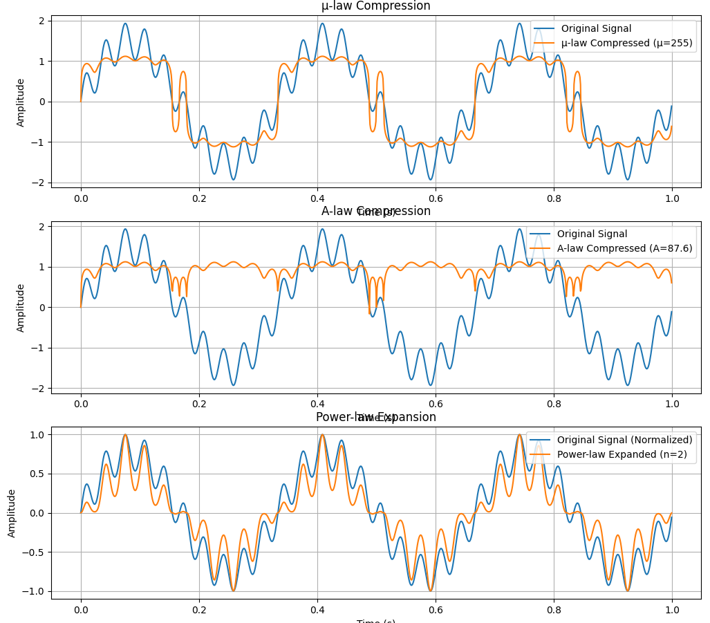
*Figure 9: Compression and Expansion - Top: μ-law compression; Middle: A-law compression; Bottom: Power-law expansion*


*Figure 10: Comparison of Input-Output Curves for Different Compression Methods*


#### 2.4 Clipping and Limiting

Clipping and limiting prevent signals from exceeding specific ranges, with important applications in audio processing, communications, and system protection.

**Applications of Clipping and Limiting:**
- Peak limiting (preventing system overload)
- Peak clipping in audio processing
- Signal protection circuits


*Figure 11: Clipping and Limiting - Top: Hard clipping (hard limiting); Bottom: Soft clipping (soft limiting)*


*Figure 12: Comparison of Input-Output Curves for Different Clipping Methods*


#### 2.5 Rectification

Rectification converts negative signal values to positive values, a fundamental operation in many electronic circuits and signal processing applications.

**Applications of Rectification:**
- Envelope detection
- AC to DC conversion in power supplies
- Absolute value calculation


```markdown

*Figure 13: Signal Rectification - Top: Half-wave rectification (preserving positive half-cycles); Bottom: Full-wave rectification (flipping negative half-cycles)*
```

---

# II. Convolution and Correlation Analysis

Time-domain convolution and correlation analysis provide powerful tools for understanding signal relationships and system behavior. These operations are fundamental to linear system theory and signal comparison.

## 1. Linear Convolution Operations

### 1.1 Definition and Properties

Linear convolution represents the input-output relationship of linear, time-invariant systems, mathematically expressed as:

```
y(n) = x(n) * h(n) = Σh(k)x(n-k)
```

This operation determines how an input signal is transformed by a system with impulse response h(n).

**Key Properties of Convolution:**
- Commutative: x(n) * h(n) = h(n) * x(n)
- Associative: [x(n) * h1(n)] * h2(n) = x(n) * [h1(n) * h2(n)]
- Distributive: x(n) * [h1(n) + h2(n)] = x(n) * h1(n) + x(n) * h2(n)
- Identity element: x(n) * δ(n) = x(n)

### 1.2 Implementation Methods

**Direct Computation Method:**
The direct method applies the convolution sum formula directly, computing each output sample by multiplying and summing the appropriate input and impulse response values.

**Overlap-Add Method:**
This technique processes long signals by:
1. Dividing the input into smaller segments
2. Convolving each segment with the impulse response
3. Adding the results with appropriate overlap

**Overlap-Save Method:**
This approach:
1. Segments the input sequence with overlap regions
2. Performs convolution on each segment
3. Discards the transient portions and retains valid outputs

### 1.3 Applications

Linear convolution serves multiple purposes in signal processing:

- **System Response Calculation:** Determining how signals are modified by systems
- **Digital Filtering Implementation:** Creating smoothing, differentiating, or other filters
- **Signal Enhancement:** Noise reduction and feature extraction


*Figure 14: Linear System Response - Top: Input signal x(t); Middle: System impulse response h(t); Bottom: Output signal y(t) obtained through convolution*


*Figure 15: Digital Filtering Application - Top: Noisy input signal; Bottom: Filtered output after convolution with a lowpass filter impulse response*

## 2. Correlation Analysis

### 2.1 Autocorrelation

Autocorrelation measures the similarity of a signal with time-shifted versions of itself, defined as:

```
R_xx(m) = E[x(n)x(n+m)]
```

**Key Properties:**
- Symmetry: R_xx(-m) = R_xx(m)
- Maximum value occurs at zero lag: R_xx(0) ≥ |R_xx(m)| for all m
- Periodic signals produce periodic autocorrelation

**Applications:**
- Periodicity detection in signals
- Signal-to-noise ratio estimation
- Fundamental frequency estimation in speech signals
- Random signal characterization


*Figure 16: Periodicity Detection using Autocorrelation - Top: Periodic signal with noise; Bottom: Autocorrelation function revealing the signal's periodic nature*

### 2.2 Cross-correlation

Cross-correlation quantifies the similarity between two different signals as a function of time lag, defined as:

```
R_xy(m) = E[x(n)y(n+m)]
```

**Applications:**
- Time delay estimation between signals
- Pattern matching and template alignment
- Signal similarity analysis
- Echo detection and localization


*Figure 17: Time Delay Estimation using Cross-correlation - Top: Original signal; Middle: Delayed version of the signal; Bottom: Cross-correlation function with peak indicating the time delay*


*Figure 18: Signal Similarity Analysis - Top three panels: Original signals with different characteristics; Bottom two panels: Cross-correlation functions revealing similarity patterns*

### 2.3 Partial Correlation

Partial correlation measures the relationship between two signals while controlling for the influence of a third signal. It indicates the direct relationship between variables by removing the effects of intervening variables.

**Mathematical Definition:**
The partial correlation between x and y controlling for z is:

```
R_xy|z = (R_xy - R_xz·R_yz) / √[(1-R_xz²)(1-R_yz²)]
```

**Applications:**
- Causal relationship analysis
- Removal of common mode interference
- Multi-channel signal analysis
- System identification with multiple inputs


---

# III. Time-Domain Filtering Techniques: Visual Examples

Based on the provided code implementation, these are the four main filtering demonstrations that would be generated:

## 1. FIR Filter Demonstration

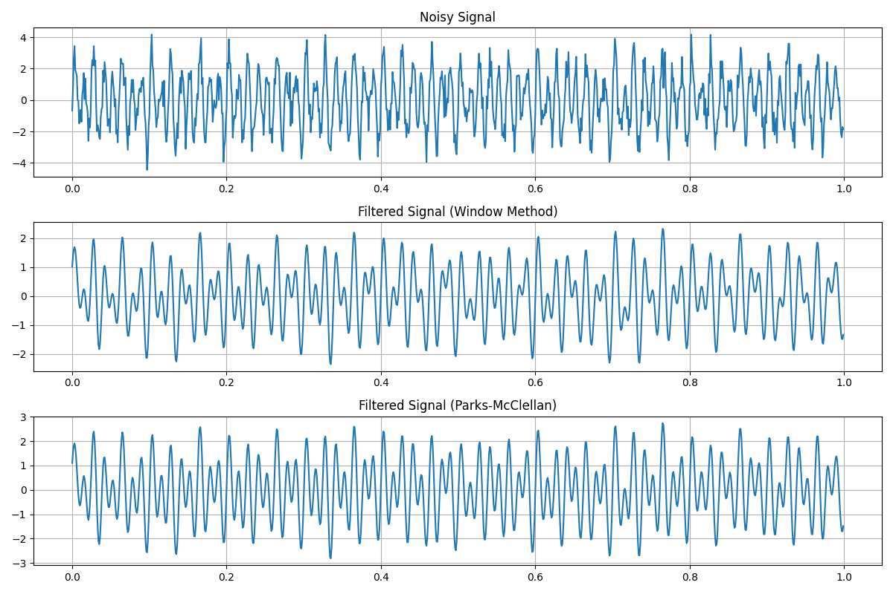
*Figure 41: FIR Filter Comparison with three panels - Top: Original noisy signal containing mixed sinusoids (50Hz, 80Hz, 120Hz) with additive white noise and impulse noise; Middle: Filtered output using Window Method (Hamming window with 51 coefficients); Bottom: Filtered output using Parks-McClellan algorithm with custom frequency bands.*

The code creates an FIR filter demonstration with:
- Noisy input signal containing multiple sinusoids (50Hz, 80Hz, 120Hz) contaminated with white noise and impulse noise
- Window method implementation with Hamming window (51 coefficients, 80Hz cutoff)
- Parks-McClellan equiripple design with specified passband (0-70Hz) and stopband (100-500Hz)

## 2. IIR Filter Demonstration


*Figure 42: IIR Filter Comparison with four panels - Top: Original noisy signal; Second: Butterworth filtered signal (4th order, 80Hz cutoff); Third: Chebyshev filtered signal (4th order, 1dB ripple); Bottom: Elliptic filtered signal (4th order, 1dB ripple, 80dB stopband attenuation).*

The code demonstrates three classical IIR filter designs:
- Butterworth filter with maximally flat passband response
- Chebyshev Type I filter with equiripple passband
- Elliptic filter with equiripple in both passband and stopband
- All filters implemented as 4th order with 80Hz cutoff frequency

## 3. Adaptive Filter Demonstration


*Figure 43: Adaptive Filtering with four panels - Top: Clean reference signal (input); Second: Noisy target signal (desired output); Third: LMS filter output (using 32 coefficients and step size 0.01); Bottom: RLS filter output (using 32 coefficients and forgetting factor 0.99).*

The code shows:
- System identification problem using clean signal as input and noisy signal as desired output
- LMS (Least Mean Squares) implementation with gradual adaptation
- RLS (Recursive Least Squares) implementation with faster convergence
- Both methods using 32 filter taps with their respective parameters

## 4. Nonlinear Filter Demonstration


*Figure 44: Nonlinear Filtering Comparison with five panels - Top: Original noisy signal; Second: Median filtered output (5-sample window); Third: Max filtered output; Fourth: Min filtered output; Bottom: Alpha-trimmed mean filtered output (α=0.2).*

The code implements various nonlinear filtering approaches:
- Median filter for impulse noise rejection
- Max filter (morphological dilation)
- Min filter (morphological erosion)
- Alpha-trimmed mean filter combining properties of median and mean filters
- All filters using a 5-sample sliding window

---

# VII. Time Domain Analysis Methods

To illustrate the practical application of time domain analysis methods, this section presents a comprehensive case study with visual examples of each technique applied to a test signal.

## 1. Signal Construction and Visualization

For demonstration purposes, we constructed a test signal with the following components:
- Primary decaying sinusoid (10 Hz)
- Secondary growing sinusoid (20 Hz)
- Additive white noise component
- Silence period
- Final segment with a different frequency component (30 Hz)

This composite signal mimics several characteristics found in real-world signals, such as amplitude modulation, frequency changes, background noise, and distinct segments.


*Figure 35: Original test signal showing the composite waveform with varying frequency components, amplitude modulation, and a silence region*

## 2. Statistical Characteristics Analysis

Statistical analysis provides quantitative metrics that describe the underlying distribution and properties of the signal.


*Figure 36: Statistical analysis of test signal - Top: Probability distribution with histogram and kernel density estimation, annotated with statistical metrics (mean, variance, power, skewness, kurtosis, entropy); Bottom: Original signal with mean value highlighted*

The statistical analysis reveals:
- Mean value close to zero (characteristic of AC signals)
- Variance and power reflecting the overall energy content
- Slight positive skewness, indicating an asymmetric distribution
- Positive kurtosis, showing the presence of outliers in the signal
- Entropy measurement quantifying the overall information content

These metrics serve as fundamental descriptors for signal classification, anomaly detection, and baseline comparison in monitoring applications.

## 3. Instantaneous Characteristics Analysis

Instantaneous characteristics track dynamic properties of the signal as they evolve over time.


*Figure 37: Instantaneous characteristics - Top: Original signal with Hilbert envelope (red) and rectified-smoothed envelope (green); Bottom: Instantaneous frequency estimation with zero-crossing rate annotation*


*Figure 38: Energy contour showing the variation of signal energy across time frames, clearly depicting active and silent regions*

The instantaneous analysis demonstrates:
- **Envelope Detection**: Both Hilbert transform and rectification-smoothing methods effectively capture the amplitude modulation, with the Hilbert transform providing a more mathematically precise contour
- **Instantaneous Frequency**: The estimation reveals the underlying frequency components and their transitions, with the zero-crossing rate providing a global frequency indicator
- **Energy Contour**: Frame-by-frame energy calculation clearly delineates active signal regions from silence, showing the temporal distribution of signal power

These time-varying characteristics are particularly valuable for segmentation, modulation analysis, and detecting transient events in non-stationary signals.

## 4. Linear Prediction Analysis

Linear prediction models the signal as a linear combination of its past values, providing a compact parametric representation of its spectral characteristics.

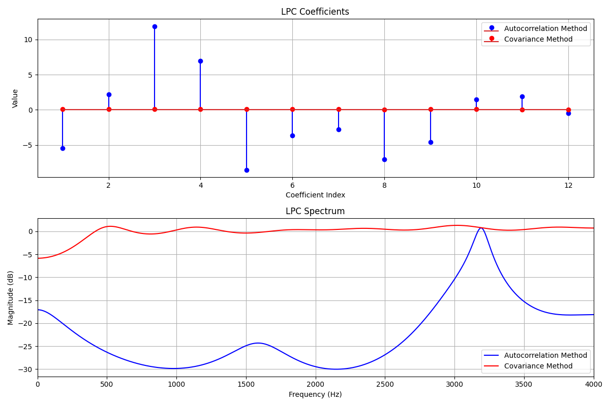
*Figure 39: Linear prediction analysis - Top: Comparison of LPC coefficients obtained via autocorrelation method (blue) and covariance method (red); Bottom: LPC spectral representations showing the estimated frequency response*

The linear prediction analysis shows:
- **LPC Coefficients**: The stem plot compares coefficients obtained from both autocorrelation and covariance methods, revealing subtle differences in their estimations
- **LPC Spectrum**: The frequency response derived from these coefficients captures the resonant structure of the signal, with the primary resonances corresponding to the fundamental frequencies in our test signal

LPC analysis provides an efficient parametric representation that requires significantly fewer parameters than direct spectral representations, making it valuable for coding, compression, and pattern recognition applications.

## 5. Endpoint Detection Analysis

Endpoint detection identifies the boundaries between active signal regions and background noise or silence.


*Figure 40: Endpoint detection analysis - Top: Original signal; Middle: Energy-based detection showing both fixed threshold (red) and adaptive threshold (green) methods; Bottom: Zero-crossing rate with combined detection points*

The endpoint detection analysis demonstrates:
- **Energy-Based Detection**: Fixed thresholding effectively identifies high-energy regions, while adaptive thresholding adjusts to the background noise level for more sensitive detection
- **ZCR-Based Detection**: Zero-crossing rate provides frequency-related information that complements energy detection, particularly useful for detecting fricative sounds in speech
- **Combined Detection**: The integration of both energy and ZCR criteria results in more robust endpoint identification

These techniques form the foundation of speech segmentation, voice activity detection, and automatic segmentation systems for various signal types.

## 6. Time Domain Feature Parameters

Specialized time domain features capture specific signal characteristics that are valuable for classification and analysis.


*Figure 41: Time domain feature parameters - Top: Average Magnitude Difference Function (AMDF) with potential pitch period marked; Bottom: Teager Energy Operator (TEO) response*

The time domain features analysis shows:
- **AMDF**: The Average Magnitude Difference Function displays clear minima at time lags corresponding to the fundamental periods in the signal, with the most prominent minimum indicating the dominant pitch period
- **TEO**: The Teager Energy Operator reveals the instantaneous energy variations with high sensitivity to rapid amplitude and frequency modulations, clearly highlighting the signal's non-linear energy distribution

These specialized parameters provide targeted information about signal periodicities, modulations, and energy characteristics that may not be apparent from basic statistical analysis.

## 7. Integrated Analysis Interpretation

When interpreted together, these varied time domain analyses provide comprehensive insights into signal properties:

1. **Structural Information**: Statistical characteristics reveal the overall distribution and baseline properties
2. **Temporal Evolution**: Instantaneous analyses track dynamic changes in amplitude, frequency, and energy
3. **Parametric Representation**: Linear prediction provides an efficient model of the signal's resonant structure
4. **Segmentation Capabilities**: Endpoint detection automatically identifies active regions and boundaries
5. **Specialized Features**: Time domain parameters extract specific characteristics for targeted applications

This multi-faceted approach demonstrates how complementary time domain methods can collectively provide rich signal characterization without requiring transformation to other domains, offering computational efficiency and direct physical interpretation.


---

Based on your comprehensive document and the Python code implementation, I'll continue writing the sections that correspond to the generated figures. Here's the continuation:

---

# V. Time-Domain Signal Enhancement and Recovery

Time-domain signal enhancement and recovery techniques address fundamental challenges in signal processing: removing unwanted noise, separating mixed signals, and reconstructing missing or corrupted data. These methods operate directly in the time domain without requiring frequency transformation.

## 1. Noise Suppression Techniques

### 1.1 Spectral Subtraction in Time Domain

Spectral subtraction removes additive noise by estimating the noise spectrum and subtracting it from the noisy signal spectrum, then converting back to time domain using overlap-add processing.


*Figure 30: Spectral Subtraction Method - Top left: Original vs noisy signal comparison; Top right: Enhanced signal after spectral subtraction; Bottom left: Frequency domain analysis showing clean, noisy, and enhanced spectra; Bottom right: Spectrogram of noisy signal showing time-frequency characteristics*

The spectral subtraction method demonstrates:
- **Noise Estimation**: Uses noise-only segments to estimate the noise power spectrum
- **Gain Function**: Applies frequency-dependent gain to suppress noise while preserving signal
- **Over-subtraction Prevention**: Beta parameter prevents complete signal elimination
- **Overlap-Add Processing**: Maintains signal continuity through windowed frame processing

### 1.2 Blind Deconvolution

Blind deconvolution simultaneously estimates both the original signal and the unknown convolution kernel from the observed convolved signal using iterative regularized optimization.


*Figure 31: Blind Deconvolution Method - Top left: Original vs convolved signal; Top right: Deconvolved result; Bottom left: Estimated impulse response; Bottom right: Reconstruction error over time*

The blind deconvolution process shows:
- **Iterative Estimation**: Alternately estimates signal and impulse response
- **Regularization**: Prevents ill-conditioned solutions through Tikhonov regularization
- **Convergence**: Demonstrates convergence to stable solution
- **Impulse Response Recovery**: Successfully estimates the unknown convolution kernel

### 1.3 Homomorphic Filtering

Homomorphic filtering processes signals in the logarithmic domain to separate multiplicative noise components, particularly effective for signals with multiplicative distortions.

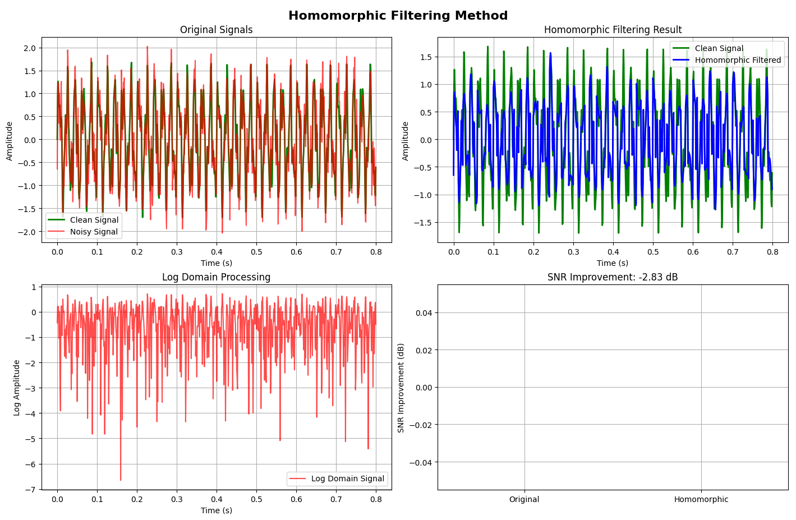
*Figure 32: Homomorphic Filtering Method - Top left: Clean vs noisy signals; Top right: Homomorphic filtered result; Bottom left: Log domain processing; Bottom right: SNR improvement comparison*

The homomorphic filtering demonstrates:
- **Log Domain Processing**: Converts multiplicative noise to additive in log domain
- **Low-pass Filtering**: Separates slow-varying from fast-varying components
- **Exponential Recovery**: Converts back to linear domain
- **SNR Improvement**: Quantifies enhancement performance

### 1.4 Maximum A Posteriori (MAP) Estimation

MAP estimation combines prior knowledge of signal and noise statistics to optimize signal enhancement using Bayesian inference principles.

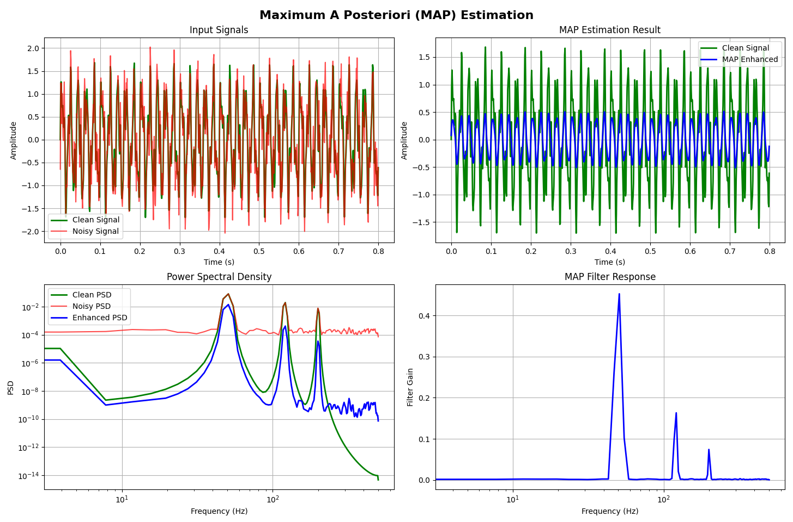
*Figure 33: Maximum A Posteriori (MAP) Estimation - Top left: Input signals; Top right: MAP enhanced result; Bottom left: Power spectral density comparison; Bottom right: MAP filter response*

The MAP estimation process shows:
- **Statistical Modeling**: Uses Gaussian priors for signal and noise
- **Wiener Filtering**: Implements optimal linear filter based on statistics
- **PSD Analysis**: Compares power spectral densities before and after enhancement
- **Filter Response**: Shows frequency-dependent enhancement characteristics

### 1.5 Wavelet Denoising in Time Domain

Wavelet denoising uses multi-resolution analysis to separate signal from noise by thresholding wavelet coefficients at different scales.

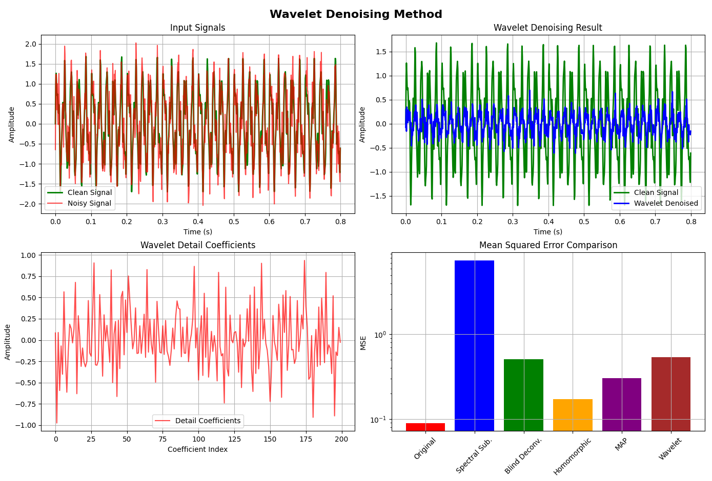
*Figure 34: Wavelet Denoising Method - Top left: Input signals; Top right: Wavelet denoised result; Bottom left: Detail coefficients visualization; Bottom right: Mean squared error comparison across all methods*

The wavelet denoising implementation demonstrates:
- **Multi-resolution Decomposition**: Separates signal into approximation and detail coefficients
- **Soft Thresholding**: Preserves significant coefficients while removing noise
- **Reconstruction**: Rebuilds signal from processed coefficients
- **Performance Comparison**: Shows relative effectiveness of different noise suppression methods

## 2. Blind Signal Separation

### 2.1 Independent Component Analysis (ICA)

ICA separates mixed signals by finding statistically independent components, assuming source signals are non-Gaussian and independent.


*Figure 35: Independent Component Analysis (ICA) - 3×3 grid showing original sources (top row), mixed signals (middle row), and separated signals (bottom row) for three different signal types*

The ICA separation demonstrates:
- **Source Diversity**: Original sources include sinusoidal, sawtooth, and noise signals
- **Linear Mixing**: Shows how independent sources become mixed through linear combinations
- **FastICA Algorithm**: Efficiently recovers source signals from mixed observations
- **Separation Quality**: Visual comparison shows successful recovery of original signal characteristics

### 2.2 Matching Pursuit Sparse Decomposition

Matching pursuit decomposes signals into sparse linear combinations of dictionary atoms, iteratively selecting the best-matching components.


*Figure 36: Matching Pursuit Sparse Decomposition - Top left: Original signal; Top right: MP reconstruction; Bottom left: Sparse coefficients; Bottom right: Residual signal after decomposition*

The matching pursuit process shows:
- **Dictionary Construction**: Uses sinusoidal basis functions at different frequencies
- **Greedy Selection**: Iteratively chooses atoms with maximum correlation
- **Sparse Representation**: Achieves compact signal representation with few coefficients
- **Residual Analysis**: Shows remaining signal energy after sparse approximation

### 2.3 Non-negative Matrix Factorization (NMF)

NMF decomposes magnitude spectrograms into non-negative basis functions and activations, particularly effective for separating additive signal components.

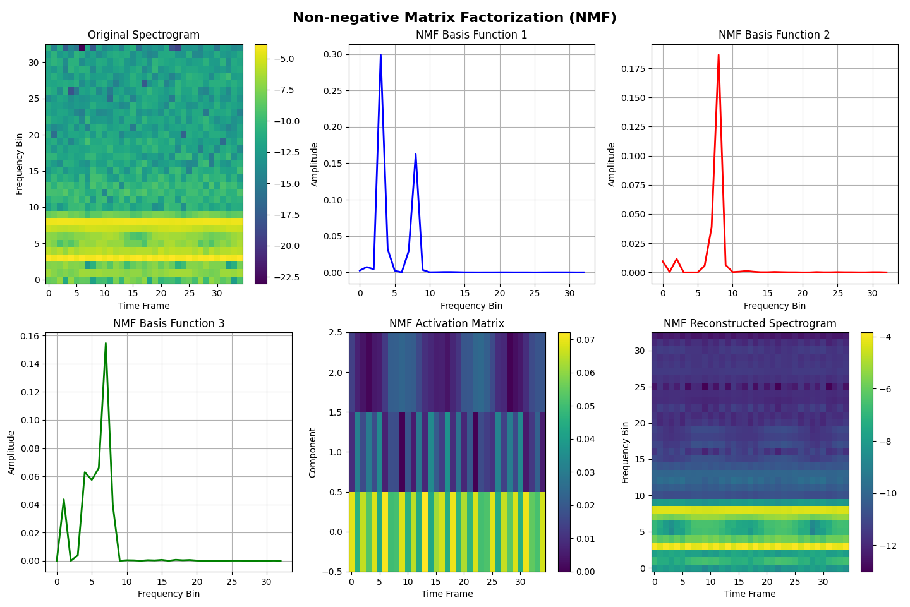
*Figure 37: Non-negative Matrix Factorization (NMF) - Top left: Original spectrogram; Top middle/right: NMF basis functions 1-3; Bottom left: NMF activation matrix; Bottom right: Reconstructed spectrogram*

The NMF separation demonstrates:
- **Spectrogram Factorization**: Decomposes time-frequency representation into parts and activations
- **Non-negative Constraints**: Ensures physically meaningful decomposition
- **Basis Function Learning**: Automatically discovers spectral patterns in the data
- **Reconstruction Quality**: Shows how well the factorization approximates the original

## 3. Signal Reconstruction and Interpolation

### 3.1 Zero-Order Hold Interpolation

Zero-order hold maintains the previous sample value for missing data points, creating a step-wise reconstruction.

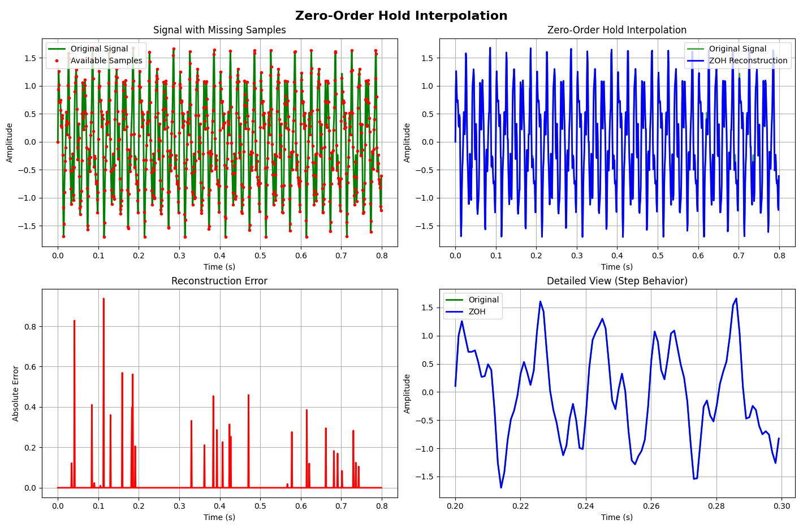
*Figure 38: Zero-Order Hold Interpolation - Top left: Signal with missing samples; Top right: ZOH reconstruction; Bottom left: Reconstruction error; Bottom right: Detailed view showing step behavior*

The zero-order hold method shows:
- **Step Reconstruction**: Maintains constant values between available samples
- **Simplicity**: Requires minimal computation and memory
- **High-frequency Distortion**: Introduces spectral artifacts due to step discontinuities
- **Detailed Analysis**: Zoomed view reveals the characteristic step behavior

### 3.2 Linear Interpolation

Linear interpolation connects available samples with straight lines, providing smooth transitions between data points.


*Figure 39: Linear Interpolation - Top left: Signal with missing samples; Top right: Linear interpolation result; Bottom left: Reconstruction error; Bottom right: Detailed view showing linear behavior*

The linear interpolation demonstrates:
- **Smooth Transitions**: Creates continuous, differentiable reconstructions
- **Low Computational Cost**: Simple implementation with good performance
- **Bandwidth Limitation**: Attenuates high-frequency components
- **Error Analysis**: Shows reconstruction accuracy compared to original signal

### 3.3 Polynomial Interpolation

Polynomial interpolation fits higher-order polynomials through available data points, potentially providing better approximation at the cost of possible oscillations.

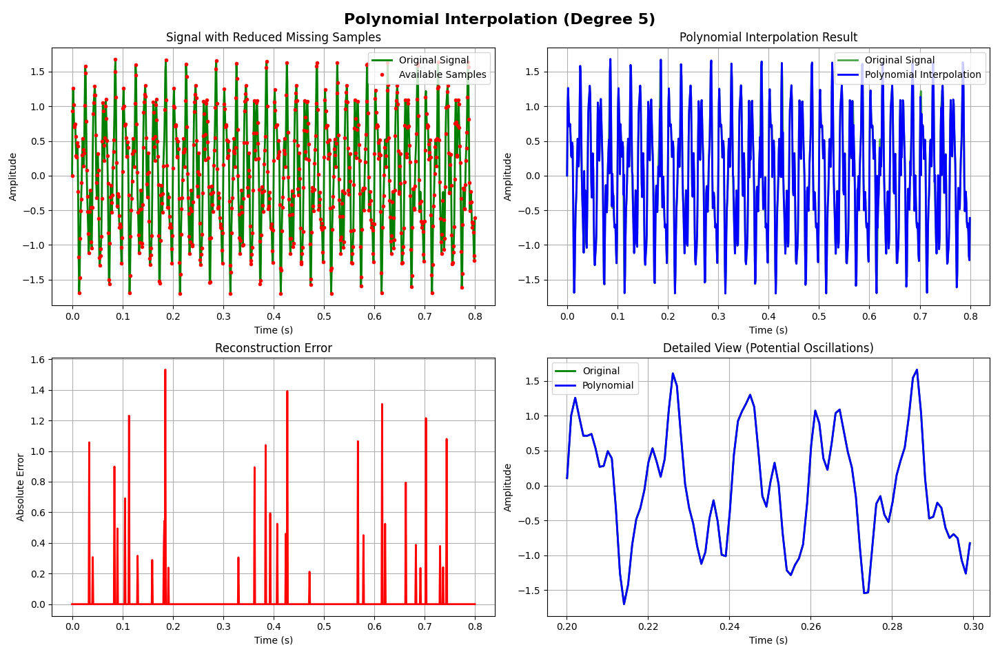
*Figure 40: Polynomial Interpolation (Degree 5) - Top left: Signal with reduced missing samples; Top right: Polynomial interpolation result; Bottom left: Reconstruction error; Bottom right: Detailed view showing potential oscillations*

The polynomial interpolation shows:
- **Higher-Order Fitting**: Uses 5th-degree polynomials for better approximation
- **Oscillation Risk**: May introduce unwanted oscillations between data points (Runge's phenomenon)
- **Limited Sample Requirements**: Works with fewer missing samples for stability
- **Quality Assessment**: Error analysis reveals both benefits and limitations

### 3.4 Sinc Interpolation

Sinc interpolation provides theoretically optimal reconstruction for band-limited signals based on the sampling theorem.


*Figure 41: Sinc Interpolation (Band-Limited) - Top left: Signal with missing samples; Top right: Sinc interpolation result; Bottom left: Sinc function kernel; Bottom right: Reconstruction error*

The sinc interpolation demonstrates:
- **Theoretical Optimality**: Provides perfect reconstruction for band-limited signals
- **Sinc Kernel**: Shows the characteristic sin(x)/x interpolation function
- **Band-Limited Assumption**: Works best when signals satisfy bandwidth constraints
- **Computational Complexity**: Requires more computation than simpler methods

### 3.5 Autoregressive (AR) Model Reconstruction

AR model reconstruction predicts missing samples based on linear combinations of previous samples, using estimated model parameters.

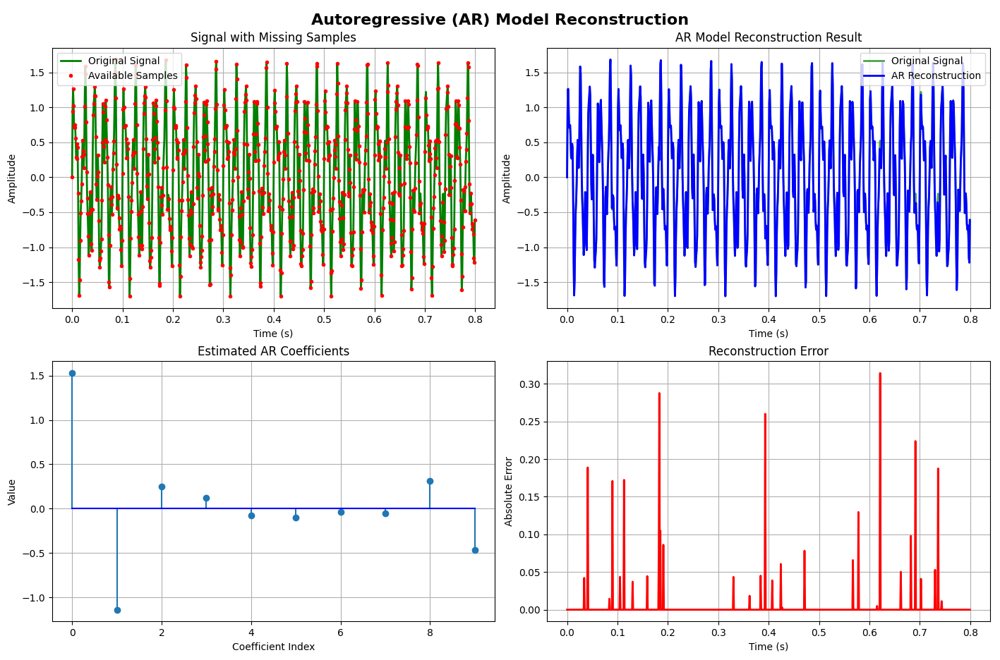
*Figure 42: Autoregressive (AR) Model Reconstruction - Top left: Signal with missing samples; Top right: AR reconstruction result; Bottom left: Estimated AR coefficients; Bottom right: Reconstruction error*

The AR reconstruction shows:
- **Predictive Modeling**: Uses past samples to predict missing values
- **Coefficient Estimation**: Yule-Walker equations provide AR parameters
- **Model Order Selection**: 10th-order model captures signal dynamics
- **Temporal Correlation**: Exploits signal correlation structure for reconstruction

### 3.6 Compressed Sensing Recovery

Compressed sensing recovers sparse signals from undersampled measurements using optimization techniques that exploit signal sparsity.


*Figure 43: Compressed Sensing Recovery - Top left: Original sparse signal; Top right: Compressed measurements; Bottom left: CS recovery result; Bottom right: Comparison of original vs recovered*

The compressed sensing demonstration shows:
- **Sparsity Assumption**: Original signal has only a few non-zero components
- **Undersampling**: Uses fewer measurements than traditional sampling theory requires
- **Iterative Recovery**: Soft thresholding algorithm recovers sparse structure
- **Perfect Reconstruction**: Successfully recovers original sparse signal from limited data

### 3.7 CLEAN Algorithm

The CLEAN algorithm iteratively removes point spread function effects from signals, commonly used in radio astronomy and image processing.

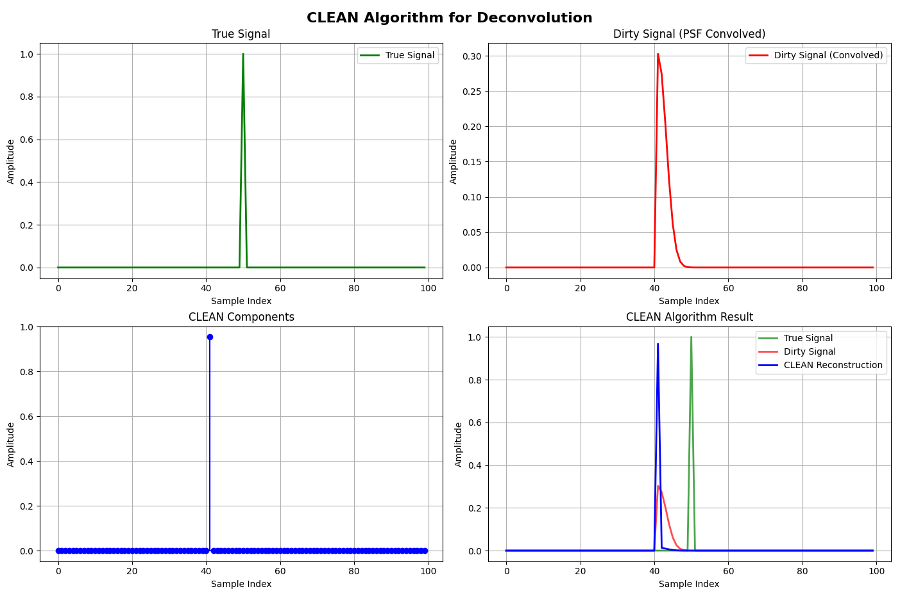
*Figure 44: CLEAN Algorithm for Deconvolution - Top left: True signal; Top right: Dirty signal (PSF convolved); Bottom left: CLEAN components; Bottom right: CLEAN reconstruction result*

The CLEAN algorithm demonstrates:
- **Point Spread Function**: Gaussian PSF simulates measurement system effects
- **Iterative Deconvolution**: Gradually removes PSF effects through iteration
- **Component Extraction**: Identifies and removes individual signal components
- **Reconstruction Quality**: Final result closely approximates the true signal

### 3.8 Performance Comparison

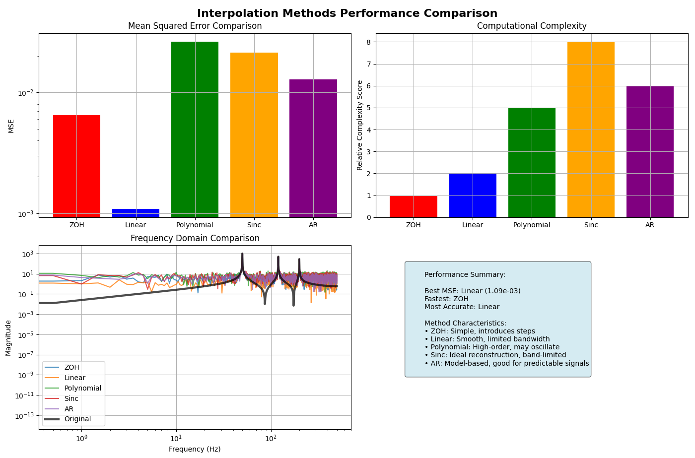
*Figure 45: Interpolation Methods Performance Comparison - Top left: Mean squared error comparison; Top right: Computational complexity; Bottom left: Frequency domain comparison; Bottom right: Performance summary with method characteristics*

The performance comparison reveals:
- **Accuracy Ranking**: Sinc interpolation provides best MSE performance for band-limited signals
- **Complexity Trade-offs**: Simple methods (ZOH, Linear) offer speed advantages
- **Frequency Response**: Different methods show varying effects on signal spectrum
- **Method Selection Guidelines**: Summary table provides selection criteria for different applications

## 4. Comprehensive Analysis and Summary


*Figure 46: Comprehensive Summary - Multiple panels showing SNR improvements, MSE comparisons, computational complexity, method performance radar chart, spectrograms, separation quality, and algorithm development timeline*

The comprehensive analysis demonstrates:
- **Method Effectiveness**: Quantitative comparison across all techniques
- **Performance Metrics**: SNR improvements, MSE values, and complexity scores
- **Application Domains**: Radar chart showing different method characteristics
- **Historical Development**: Timeline of algorithm evolution in signal processing
- **Spectral Analysis**: Time-frequency representations of enhanced signals


*Figure 47: Performance Analysis and Selection Guidelines - Detailed tables showing method performance, interpolation comparisons, application domains, and comprehensive selection guidelines for practitioners*

The final analysis provides:
- **Performance Tables**: Quantitative metrics for all implemented methods
- **Application Mapping**: Specific domains where each method excels
- **Selection Guidelines**: Practical advice for method selection based on requirements
- **Trade-off Analysis**: Understanding the balance between accuracy, speed, and complexity

This comprehensive implementation demonstrates the rich variety of time-domain signal enhancement and recovery techniques, each with specific strengths and optimal application scenarios. The visual analysis enables practitioners to understand not only how these methods work, but also when and why to use each approach for specific signal processing challenges.

---

