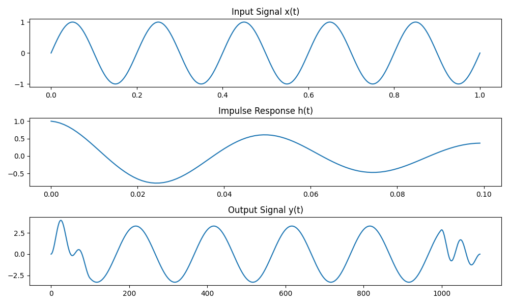

# Digital-Signal-Processing-Time-Domain
Time domain signal processing is a collection of methods for operating on and analyzing signals directly in the time dimension. Unlike frequency domain or time-frequency domain processing, time domain processing acts directly on the original form of the signal and does not require domain transformation.

# Time-Domain Signal Processing Methods: A Comprehensive Guide

Time-domain signal processing forms the foundation of digital signal processing by directly manipulating signals in the time dimension. Understanding these techniques is essential for implementing more complex signal processing systems.

## I. Basic Time-Domain Operations

Time-domain signal processing encompasses two main categories: basic signal operations and point-by-point non-linear transformations. These operations serve as fundamental building blocks for more sophisticated signal processing systems.

### 1. Basic Signal Operations

#### 1.1 Addition and Subtraction

Signal addition is used for signal mixing, such as combining multiple channels, while subtraction is commonly employed for interference or noise cancellation.

**Applications of Signal Addition:**
- Audio mixing (multi-track synthesis)
- Signal synthesis and modulation
- Multi-sensor data fusion

**Applications of Signal Subtraction:**
- Noise cancellation
- Background suppression
- Differential signal processing


*Figure 1: Basic Signal Demonstration - Shows the fundamental sine waves and noise used for subsequent processing*


*Figure 2: Signal Addition and Subtraction Demonstration - Top: Signal mixing; Bottom: Noise cancellation*


#### 1.2 Multiplication

Signal multiplication enables modulation, gating, and windowing operations, with wide applications in communications, audio processing, and data analysis.

**Applications of Multiplication:**
- Amplitude Modulation (AM)
- Time-domain windowing (reducing spectral leakage)
- Signal gating (controlling signal timing)


*Figure 3: Signal Multiplication Operations - Top: AM modulation; Middle: Window function application; Bottom: Signal gating*


#### 1.3 Time Shift and Scaling

Time shift operations change the position of signals along the time axis, while scaling transforms compress or expand signals in time.

**Applications of Time Shift and Scaling:**
- Signal alignment and synchronization
- Time delay estimation and compensation
- Speech rate conversion (speed-up or slow-down)
- Doppler effect correction


*Figure 4: Time Shift and Scaling - Top: Time shift operation; Middle: Time compression (speed-up); Bottom: Time expansion (slow-down)*


#### 1.4 Differentiation and Integration

Differentiation extracts the rate of change in signals, helping to detect edges and rapid variations. Integration calculates the cumulative properties of signals, useful for energy calculations and trend analysis.

**Applications of Differentiation:**
- Edge detection (image processing)
- Rate-of-change analysis
- Peak and zero-crossing detection

**Applications of Integration:**
- Cumulative energy calculation
- Signal smoothing
- Trend analysis


*Figure 5: Differentiation and Integration - Top: Edge detection (differentiation); Bottom: Signal integration (cumulative properties)*


### 2. Point-by-Point Non-Linear Transformations

#### 2.1 Quantization

Quantization converts continuous-amplitude signals into discrete levels, a key step in analog-to-digital conversion. The quantization precision (number of levels) determines the resolution of digital representation.

**Applications of Quantization:**
- Analog-to-digital conversion
- Digital audio and image processing
- Data compression


*Figure 6: Signal Quantization - Top: 8-level quantization; Bottom: 4-level quantization*


*Figure 7: Detailed View of 4-Level Quantization - Shows quantization levels and quantization noise*


#### 2.2 Threshold Processing

Threshold processing applies binary decisions or truncation based on a set threshold value, widely used in signal detection and feature extraction.

**Applications of Threshold Processing:**
- Voice Activity Detection (VAD)
- Signal denoising
- Binary conversion


*Figure 8: Threshold Processing - Top: Soft thresholding (preserving above-threshold signals); Bottom: Binary thresholding (converting to 0/1 signal)*


#### 2.3 Compression and Expansion

Compression and expansion operations modify the dynamic range of signals, making small signals more perceptible or processable while preventing large signals from distortion.

**Applications of Compression and Expansion:**
- Dynamic range compression (audio processing)
- μ-law and A-law compression (telecommunication systems)
- Logarithmic compression (auditory perception optimization)


*Figure 9: Compression and Expansion - Top: μ-law compression; Middle: A-law compression; Bottom: Power-law expansion*


*Figure 10: Comparison of Input-Output Curves for Different Compression Methods*


#### 2.4 Clipping and Limiting

Clipping and limiting prevent signals from exceeding specific ranges, with important applications in audio processing, communications, and system protection.

**Applications of Clipping and Limiting:**
- Peak limiting (preventing system overload)
- Peak clipping in audio processing
- Signal protection circuits


*Figure 11: Clipping and Limiting - Top: Hard clipping (hard limiting); Bottom: Soft clipping (soft limiting)*


*Figure 12: Comparison of Input-Output Curves for Different Clipping Methods*


#### 2.5 Rectification

Rectification converts negative signal values to positive values, a fundamental operation in many electronic circuits and signal processing applications.

**Applications of Rectification:**
- Envelope detection
- AC to DC conversion in power supplies
- Absolute value calculation


```markdown

*Figure 13: Signal Rectification - Top: Half-wave rectification (preserving positive half-cycles); Bottom: Full-wave rectification (flipping negative half-cycles)*
```

---

# II. Convolution and Correlation Analysis

Time-domain convolution and correlation analysis provide powerful tools for understanding signal relationships and system behavior. These operations are fundamental to linear system theory and signal comparison.

## 1. Linear Convolution Operations

### 1.1 Definition and Properties

Linear convolution represents the input-output relationship of linear, time-invariant systems, mathematically expressed as:

```
y(n) = x(n) * h(n) = Σh(k)x(n-k)
```

This operation determines how an input signal is transformed by a system with impulse response h(n).

**Key Properties of Convolution:**
- Commutative: x(n) * h(n) = h(n) * x(n)
- Associative: [x(n) * h1(n)] * h2(n) = x(n) * [h1(n) * h2(n)]
- Distributive: x(n) * [h1(n) + h2(n)] = x(n) * h1(n) + x(n) * h2(n)
- Identity element: x(n) * δ(n) = x(n)

### 1.2 Implementation Methods

**Direct Computation Method:**
The direct method applies the convolution sum formula directly, computing each output sample by multiplying and summing the appropriate input and impulse response values.

**Overlap-Add Method:**
This technique processes long signals by:
1. Dividing the input into smaller segments
2. Convolving each segment with the impulse response
3. Adding the results with appropriate overlap

**Overlap-Save Method:**
This approach:
1. Segments the input sequence with overlap regions
2. Performs convolution on each segment
3. Discards the transient portions and retains valid outputs

### 1.3 Applications

Linear convolution serves multiple purposes in signal processing:

- **System Response Calculation:** Determining how signals are modified by systems
- **Digital Filtering Implementation:** Creating smoothing, differentiating, or other filters
- **Signal Enhancement:** Noise reduction and feature extraction


*Figure 14: Linear System Response - Top: Input signal x(t); Middle: System impulse response h(t); Bottom: Output signal y(t) obtained through convolution*


*Figure 15: Digital Filtering Application - Top: Noisy input signal; Bottom: Filtered output after convolution with a lowpass filter impulse response*

## 2. Correlation Analysis

### 2.1 Autocorrelation

Autocorrelation measures the similarity of a signal with time-shifted versions of itself, defined as:

```
R_xx(m) = E[x(n)x(n+m)]
```

**Key Properties:**
- Symmetry: R_xx(-m) = R_xx(m)
- Maximum value occurs at zero lag: R_xx(0) ≥ |R_xx(m)| for all m
- Periodic signals produce periodic autocorrelation

**Applications:**
- Periodicity detection in signals
- Signal-to-noise ratio estimation
- Fundamental frequency estimation in speech signals
- Random signal characterization


*Figure 16: Periodicity Detection using Autocorrelation - Top: Periodic signal with noise; Bottom: Autocorrelation function revealing the signal's periodic nature*

### 2.2 Cross-correlation

Cross-correlation quantifies the similarity between two different signals as a function of time lag, defined as:

```
R_xy(m) = E[x(n)y(n+m)]
```

**Applications:**
- Time delay estimation between signals
- Pattern matching and template alignment
- Signal similarity analysis
- Echo detection and localization


*Figure 17: Time Delay Estimation using Cross-correlation - Top: Original signal; Middle: Delayed version of the signal; Bottom: Cross-correlation function with peak indicating the time delay*


*Figure 18: Signal Similarity Analysis - Top three panels: Original signals with different characteristics; Bottom two panels: Cross-correlation functions revealing similarity patterns*

### 2.3 Partial Correlation

Partial correlation measures the relationship between two signals while controlling for the influence of a third signal. It indicates the direct relationship between variables by removing the effects of intervening variables.

**Mathematical Definition:**
The partial correlation between x and y controlling for z is:

```
R_xy|z = (R_xy - R_xz·R_yz) / √[(1-R_xz²)(1-R_yz²)]
```

**Applications:**
- Causal relationship analysis
- Removal of common mode interference
- Multi-channel signal analysis
- System identification with multiple inputs
